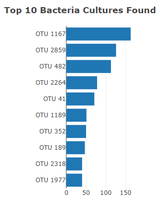
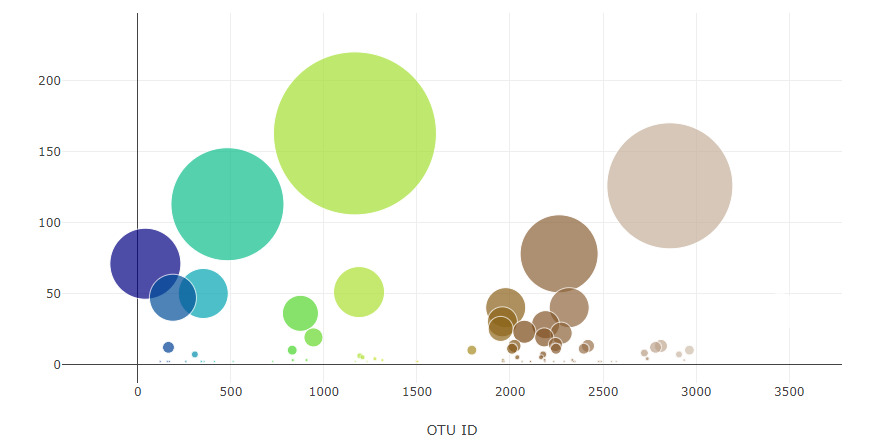
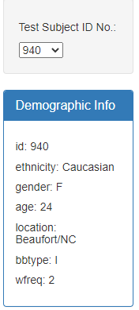
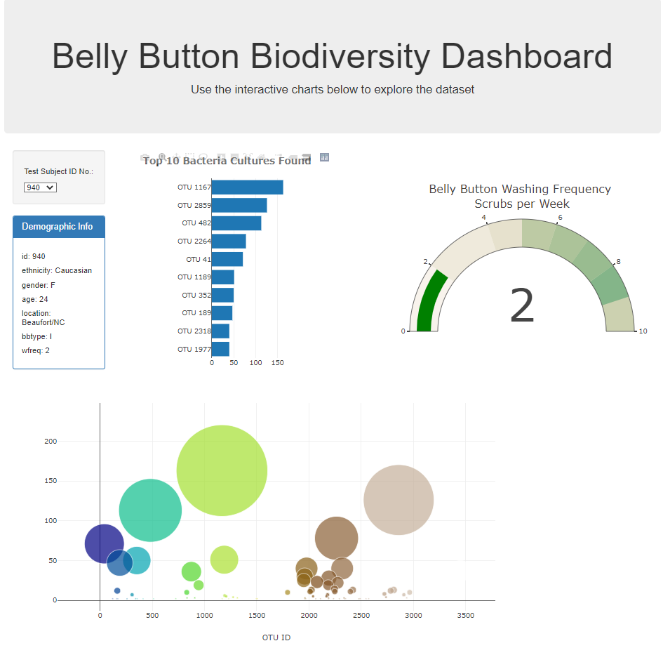

# belly-button-challenge
Module 14 Challenge

# Belly Button Biodiversity Dashboard

Click on the link to view Belly Button Biodiversity Dashboard https://gilev0.github.io/belly-button-challenge

In this project we built an interactive dashboard to explore the [Belly Button Biodiversity dataset](http://robdunnlab.com/projects/belly-button-biodiversity/). 

## Overview

I used the D3 library to read in `samples.json` then created a horizontal bar chart with a dropdown menu to display the top 10 OTUs found in that individual. Then used sample_values` as the values for the bar chart.  Next I used `otu_ids` as the labels for the bar chart and `otu_labels` as the hovertext for the chart. 

`

I then created a bubble chart displaying each sample, using `otu_ids` for the x values, `sample_values` for the y values, `sample_values` for the marker size, `otu_ids` for the marker colors, and `otu_labels` for the text values.

I displayed the sample metadata (an individual's demographic information), then displayed each key-value pair from the metadata JSON object.

The final result:  

